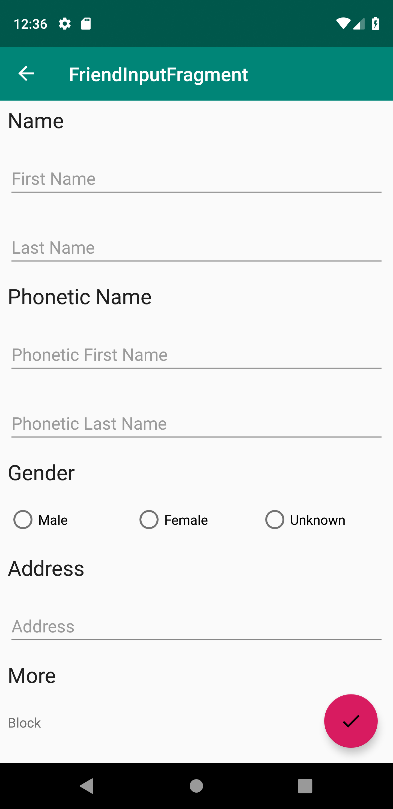

android-epoxy-example
--

## Overview

This is a sample of an input form using Airbnb Epoxy.

## Using Components

It uses the following components:

- Epoxy
- Koin
- Android Navigation Architecture Component
- Android Architecture Components(ViewModel, LiveData)

Data binding is not used.
Instead use custom view.

